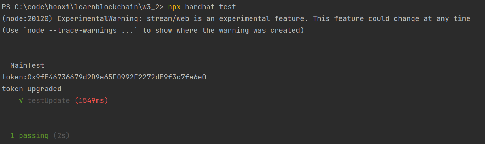

# W1_2
### 题目

### 测试通过

### 铸造NTF(社死警告！)
https://testnets.opensea.io/zh-CN/assets/mumbai/0x1e32be725457a7244fe042f50839c29696cbfe5b/2

### 部署合约完成 
https://mumbai.polygonscan.com/address/0xc91aeff8d82878645d704d7278ec17642e88e9b4#code
https://mumbai.polygonscan.com/address/0x46a1240baef1969bfb8fcc0c3d7320df9689cd18#code
https://mumbai.polygonscan.com/address/0x1e32be725457a7244fe042f50839c29696cbfe5b#code
https://mumbai.polygonscan.com/address/0x0b4d8d67876ef36234444b13fa816cf0879eb1fd#code

