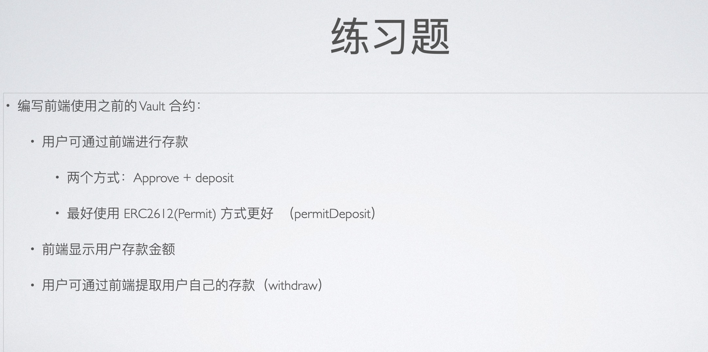
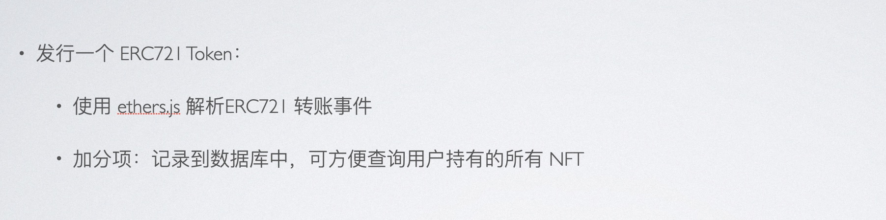
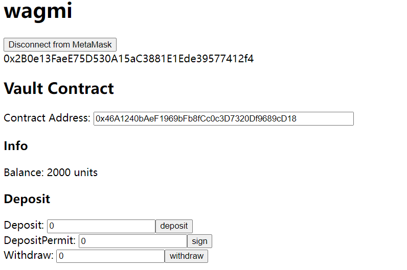
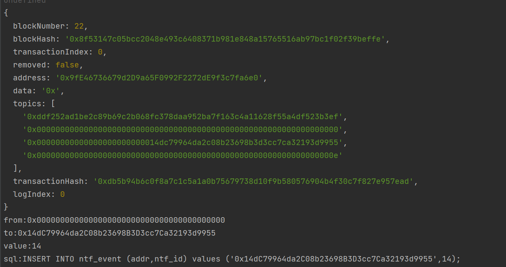
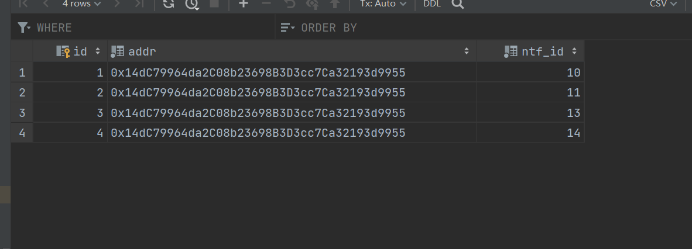
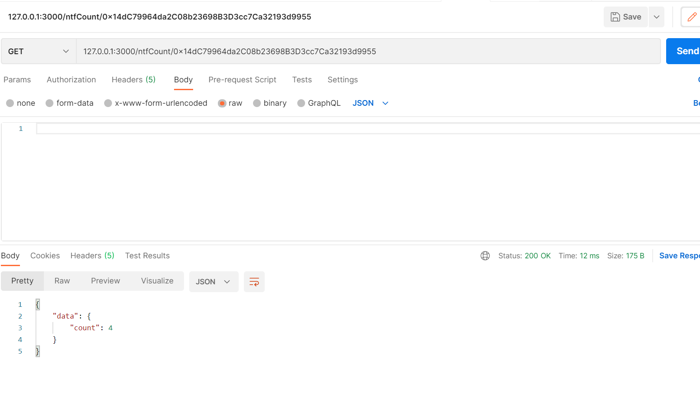

# W1_2
### 题目

### Vault合约

#### Deposit
https://sepolia.etherscan.io/tx/0x902ad738129a6b863ace12a59a48a1c614acc14064d8bf8dc248d00b0bacd6f4
https://sepolia.etherscan.io/tx/0x36cc5c508aa09caa6aad78e973783b6c96bebfd504411423ae6c01687112c911
#### DepositPermit
https://sepolia.etherscan.io/tx/0x3cd2af4dd0fa5d0028621ba058dc9ba93c10b873deff64e1d8dbfee5a974e0ff
#### withdraw
https://sepolia.etherscan.io/tx/0x13c6e6f2175946ff88fa1c5ab10cb548a73dd92e84996ed72c328438fd70943a

### 服务器记录ERC721 EVENT
#### 这里监听的是本地节点

#### 监听到event

#### 入库

#### 提供接口查询

