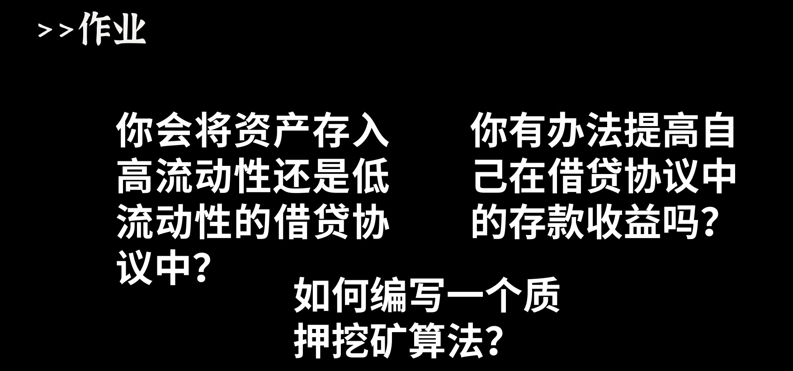

# W6_2

### 题目



#### Q1 你会将资产存在高流动性还是低流动性的协议中?

单从利率的角度来讲,存在低流动性的协议中的资产收益更高

#### Q2 你有办法提高自己在借贷协议中的存款收益么？

根据上一个问题,存在低流动性协议中?

#### Q3 如何编写一个质押挖矿算法

本质上就是确定每个区块的产出,然后获取执行时的区块间隔,然后计算出产出的数量,然后计算出每个用户的收益

以sushiswap的MasterChef为例
```agsl

 // Update reward variables of the given pool to be up-to-date.
    function updatePool(uint256 _pid) public {
        //获取池子信息
        PoolInfo storage pool = poolInfo[_pid];
        if (block.number <= pool.lastRewardBlock) {
            return;
        }
        
        //获取池子中的lp数量
        uint256 lpSupply = pool.lpToken.balanceOf(address(this));
        //为0说明没人存,也就没有奖励
        if (lpSupply == 0) {
            pool.lastRewardBlock = block.number;
            return;
        }
        
        //获取区块间隔
        uint256 multiplier = getMultiplier(pool.lastRewardBlock, block.number);
        
        //计算奖励生成数量
        uint256 sushiReward =
            multiplier.mul(sushiPerBlock).mul(pool.allocPoint).div(
                totalAllocPoint
            );
        
        //生成1/10给到开发者
        sushi.mint(devaddr, sushiReward.div(10));
        //生成奖励
        sushi.mint(address(this), sushiReward);
        
        //更新奖励数量
        pool.accSushiPerShare = pool.accSushiPerShare.add(
            sushiReward.mul(1e12).div(lpSupply)
        );
        
        //更新最后奖励区块
        pool.lastRewardBlock = block.number;
        
        
         // Deposit LP tokens to MasterChef for SUSHI allocation.
    function deposit(uint256 _pid, uint256 _amount) public {
        PoolInfo storage pool = poolInfo[_pid];
        UserInfo storage user = userInfo[_pid][msg.sender];
        
        //更新池子生成sushi
        updatePool(_pid);
        if (user.amount > 0) {
            //计算用户的奖励
            uint256 pending =
                user.amount.mul(pool.accSushiPerShare).div(1e12).sub(
                    user.rewardDebt
                );
            //发送奖励
            safeSushiTransfer(msg.sender, pending);
        }
        pool.lpToken.safeTransferFrom(
            address(msg.sender),
            address(this),
            _amount
        );
        user.amount = user.amount.add(_amount);
        user.rewardDebt = user.amount.mul(pool.accSushiPerShare).div(1e12);
        emit Deposit(msg.sender, _pid, _amount);
    }
        
    }

```


